# 4.4 DATA FLOW DIAGRAMS (DFD) & SYSTEM FLOW DIAGRAMS (SFD)

Data Flow Diagrams visualize how information moves through the OralCare AI system, showing processes, data stores, and external entities. These diagrams are provided in Mermaid code format.

## Context Diagram (DFD Level 0)

Shows the system as a single process with external entities.

```mermaid
graph TD
    Doctor[👨‍⚕️ Doctor/Healthcare Provider]
    Admin[👨‍💼 Administrator]
    Researcher[👨‍🔬 Researcher]
    Student[👨‍🎓 Student]

    System((OralCare AI<br/>System))

    DB[(Supabase<br/>Database)]
    Storage[(Supabase<br/>Storage)]

    Doctor -->|Upload Images<br/>Generate Reports| System
    System -->|AI Results<br/>PDF Reports| Doctor

    Admin -->|Manage Users<br/>Monitor System| System
    System -->|Analytics<br/>Logs| Admin

    Researcher -->|Access Data| System
    System -->|Statistics<br/>Exports| Researcher

    Student -->|Practice Cases| System
    System -->|Learning Feedback| Student

    System <-->|Store/Retrieve Data| DB
    System <-->|Store/Retrieve Files| Storage

    style System fill:#4A90E2,stroke:#2C3E50,stroke-width:3px,color:#fff
    style Doctor fill:#28a745,stroke:#1e7e34,color:#fff
    style Admin fill:#dc3545,stroke:#c82333,color:#fff
    style Researcher fill:#ffc107,stroke:#e0a800,color:#000
    style Student fill:#17a2b8,stroke:#117a8b,color:#fff
```

---

## Level 1 DFD - Main System Processes

Decomposes the system into major functional processes.

```mermaid
graph TB
    subgraph External
        User[👤 User]
        Storage[(☁️ Supabase Storage)]
    end

    subgraph "OralCare AI System"
        P1[1.0<br/>User<br/>Authentication]
        P2[2.0<br/>Image Upload<br/>& Validation]
        P3[3.0<br/>AI Detection<br/>Analysis]
        P4[4.0<br/>Results<br/>Management]
        P5[5.0<br/>Report<br/>Generation]
        P6[6.0<br/>User<br/>Management]

        D1[(Users)]
        D2[(Images)]
        D3[(Detection<br/>Results)]
        D4[(Reports)]
    end

    User -->|Login Credentials| P1
    P1 -->|Auth Token| User
    P1 <--> D1

    User -->|Image File| P2
    P2 --> D2
    P2 <-->|Image File| Storage
    P2 -->|Validated Image| P3

    P3 -->|RegNetY320 & VGG16| P3
    P3 --> D3
    P3 -->|Results| P4

    D2 --> P4
    D3 --> P4
    P4 -->|Display Results| User

    User -->|Report Request| P5
    D3 --> P5
    D2 --> P5
    P5 --> D4
    P5 <-->|PDF File| Storage
    P5 -->|Download| User

    User -->|Admin Actions| P6
    P6 <--> D1
    P6 -->|Dashboard| User

    style P1 fill:#e3f2fd,stroke:#1976d2
    style P2 fill:#e8f5e9,stroke:#388e3c
    style P3 fill:#fff3e0,stroke:#f57c00
    style P4 fill:#f3e5f5,stroke:#7b1fa2
    style P5 fill:#fce4ec,stroke:#c2185b
    style P6 fill:#e0f2f1,stroke:#00897b
```

---

## Level 2 DFD - Image Upload and Detection

Detailed workflow for image upload and AI analysis.

---

## System Architecture Diagram

Technical architecture showing all components.

---

## User Authentication Sequence Diagram

```mermaid
sequenceDiagram
    participant U as 👤 User
    participant B as 🌐 Browser
    participant D as Django
    participant DB as 💾 Database
    participant S as 🔐 Session

    U->>B: Enter credentials
    B->>D: POST /accounts/login/
    D->>D: Validate CSRF token
    D->>DB: Query user by email
    DB-->>D: User record
    D->>D: Verify password hash

    alt ✅ Valid Credentials
        D->>S: Create session
        S-->>D: Session ID
        D->>DB: Update last_login
        D-->>B: Set session cookie
        B-->>U: ✅ Redirect to dashboard
    else ❌ Invalid Credentials
        D-->>B: Return error
        B-->>U: ❌ Show error message
    end
```

---

## Image Upload and Analysis Sequence

```mermaid
sequenceDiagram
    participant U as 👤 User
    participant B as 🌐 Browser
    participant D as Django
    participant S as ☁️ Storage
    participant DB as 💾 Database
    participant AI as 🤖 AI Models

    U->>B: Select image
    B->>B: ✓ Client validation
    B->>D: POST /detection/upload/
    D->>D: ✓ Validate file
    D->>S: Upload image
    S-->>D: File URL
    D->>DB: Create image record

    D->>D: Read image
    D->>AI: Preprocess & Inference

    par RegNetY320 Analysis
        AI->>AI: RegNetY320 prediction
        AI-->>D: 🎯 Result + confidence
    and VGG16 Analysis
        AI->>AI: VGG16 prediction
        AI-->>D: 🎯 Result + confidence
    end

    D->>DB: Store results
    D->>DB: Update image status
    D-->>B: Return JSON results
    B-->>U: 📊 Display results
```

---

## Report Generation Sequence

```mermaid
sequenceDiagram
    participant U as 👤 User
    participant D as Django
    participant DB as 💾 Database
    participant S as ☁️ Storage
    participant PDF as 📄 PDF Generator

    U->>D: Request report
    D->>DB: Fetch detection results
    D->>DB: Fetch image metadata
    DB-->>D: Results + Image
    D->>S: Fetch image file
    S-->>D: Image binary

    D->>PDF: Generate PDF
    PDF->>PDF: Create document
    PDF->>PDF: Add patient info
    PDF->>PDF: Embed image
    PDF->>PDF: Add AI results
    PDF->>PDF: Add recommendations
    PDF-->>D: PDF binary

    D->>S: Upload PDF
    S-->>D: PDF URL
    D->>DB: Create report record
    D-->>U: 📥 Download link
```

---

## Entity Relationship Diagram (ERD)

---

## System Workflow Diagram

```mermaid
flowchart TD
    Start([👤 User Starts]) --> Login{Logged In?}
    Login -->|No| LoginPage[Login Page]
    LoginPage --> Auth{Valid<br/>Credentials?}
    Auth -->|No| LoginPage
    Auth -->|Yes| Dashboard

    Login -->|Yes| Dashboard[📊 Dashboard]

    Dashboard --> Action{Choose Action}

    Action -->|Upload| Upload[📤 Upload Image]
    Upload --> Validate{Valid<br/>File?}
    Validate -->|No| Upload
    Validate -->|Yes| Store[💾 Store Image]
    Store --> Process[🤖 AI Analysis]
    Process --> Results[📊 Show Results]

    Action -->|History| History[📋 View History]
    History --> Select{Select<br/>Image?}
    Select -->|Yes| Results
    Select -->|No| History

    Action -->|Report| ReportForm[📝 Report Form]
    ReportForm --> Generate[📄 Generate PDF]
    Generate --> Download[📥 Download]

    Action -->|Logout| Logout[👋 Logout]

    Results --> Action
    Download --> Action
    Logout --> End([End])

    style Start fill:#4caf50,color:#fff
    style End fill:#f44336,color:#fff
    style Dashboard fill:#2196f3,color:#fff
    style Process fill:#ff9800,color:#fff
    style Results fill:#9c27b0,color:#fff
```

---

These diagrams provide comprehensive visualization of the OralCare AI system's data flows, architecture, and processes. They can be rendered using any Mermaid-compatible tool or documentation platform.

